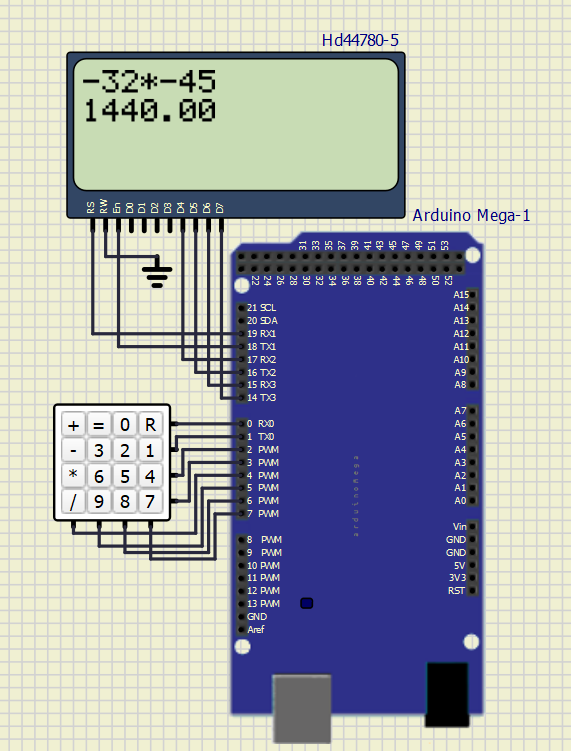
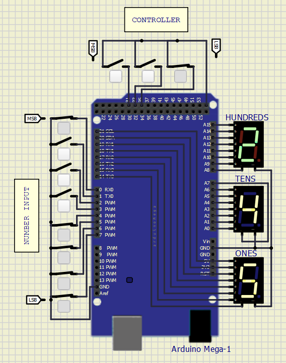
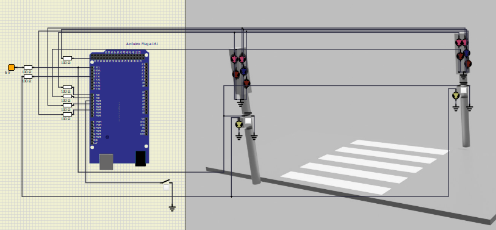
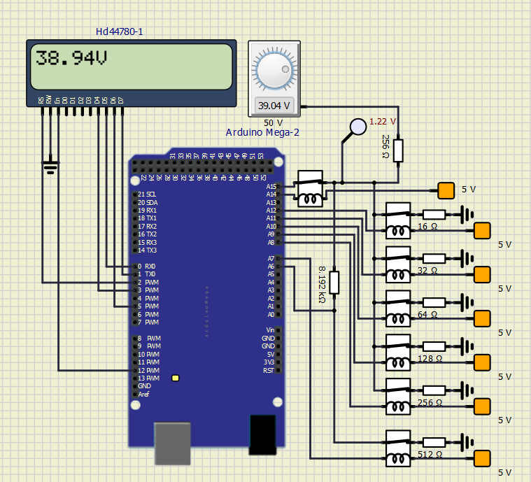

# Fundamentals of Microprocessor Technology
 

Assignments from the subject of Fundamentals of Microprocessor Technology. Built using SimulIDE and Arduino IDE. Solutions are based on the Arduino Mega controller.
## Content

1. **Simple calculator:**
Built using a keypad and LCD. Capable of execution of simple arithmetic operations on two integers.

 

  

    
  

2. **Clock:**
Built using servomechanisms, seven-segment displays and steppers. It counts down the time that has elapsed since the mechanism was switched on and gives a short beep after each minute has elapsed.

 

  

    
  

3. **Codes converter:**
Converts a number from binary form (Input on the left side of the board) to the code of a seven-segment display. Input from the top side of the  board (also in binary form) determines the type of code to be used,  according to a list:

 

0 - Binary code to decimal code

1 - Gray code to decimal code

2 - Binary to hexadecimal code

3 - Gray code to hexadecimal code

4 - Aiken code to decimal code

5 - Aiken code to hexadecimal code

6 - Johnson code to the decimal code

7 - Johnson code to hexadecimal code

 

Example:

Controller input: 001(2) = 1(10)

Number input: 10001111(GRAY) = 245(10)

 

  

    
  

4. **Pedestrian crossing:**
Simple simulation of a pedestrian crossing. When the button is pressed at the traffic lights, a sequence of green lights for pedestrians is activated and then the green lights for drivers are switched back on.  The second switch (located outside the image) turns on night mode.

 

  

    
  

5. **Multi-band voltmeter:**
Built with the help of voltage dividers. Allows to safely measure the applied voltage in the range of 0-50V (avoiding burning the Arduino board). May require some time to automatically tune the system to measure voltage more precisely.

 

  

    
  

