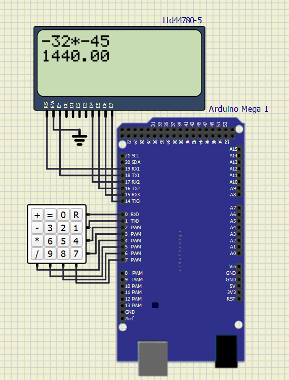
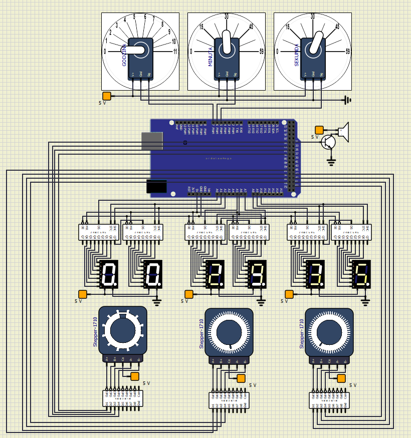
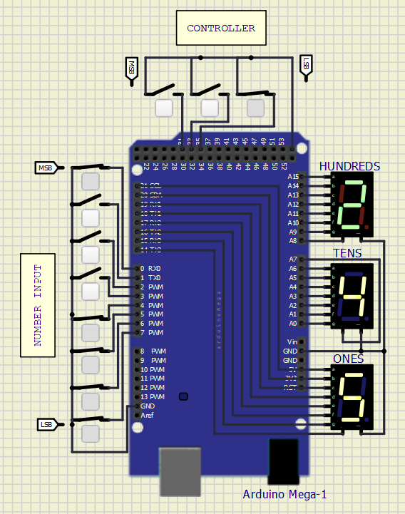
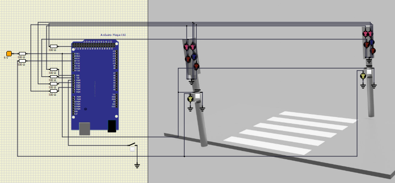
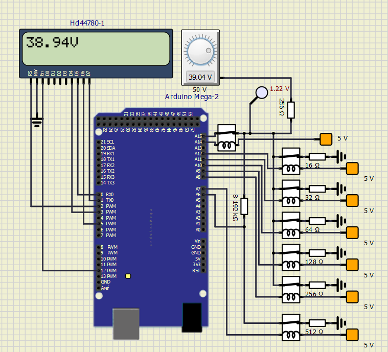

# Microprocessor Simulations

Assignments from the subject of Fundamentals of Microprocessor Technology. Built using SimulIDE and Arduino IDE. Solutions are based on the Arduino Mega controller.

## Design Notes

*   **Direct hardware I/O**: the projects control peripherals at the pin level — keypad matrix scanning, LCD via `LiquidCrystal`, seven-segment displays, servos, steppers, and relays.
*   **Safety & auto-ranging** (voltmeter): voltage-divider scaling extends the safe measurement range to 0–50V, with a relay ladder that protects the board from dangerous voltages and auto-tunes for precision.
*   **Input state handling** (calculator): a flag-based state machine tracks first character, sign, operator, and error conditions across a multi-key input flow.
*   **Code conversion** (codes_converter): translates between binary, Gray, Aiken, and Johnson codes and decimal/hexadecimal output on a seven-segment display.
*   **Timing** (clock): elapsed-time countdown with a per-minute beep.

## Projects

| | | |
|---|---|---|
| 
 <b>Calculator</b>
 | 
 <b>Clock</b>
 | 
 <b>Codes converter</b>
 |
| 
 <b>Pedestrian crossing</b>
 | 
 <b>Multi-band voltmeter</b>
 | |

1. **Calculator** — keypad and LCD, capable of simple arithmetic operations on two integers.
2. **Clock** — servomechanisms, seven-segment displays, and steppers. Counts down the time elapsed since the mechanism was switched on and gives a short beep after each minute.
3. **Codes converter** — converts a number from binary form (input on the left side of the board) to the code of a seven-segment display. Input from the top side of the board (also in binary form) determines the type of code to be used.
4. **Pedestrian crossing** — simulation of a pedestrian crossing. When the button is pressed at the traffic lights, a sequence of green lights for pedestrians is activated and then the green lights for drivers are switched back on. The second switch (located outside the image) turns on night mode.
5. **Multi-band voltmeter** — built with the help of voltage dividers. Allows to safely measure the applied voltage in the range of 0-50V (avoiding burning the Arduino board). May require some time to automatically tune the system to measure voltage more precisely.

The **codes converter** input selector uses these code types:

* 0 - Binary code to decimal code
* 1 - Gray code to decimal code
* 2 - Binary to hexadecimal code
* 3 - Gray code to hexadecimal code
* 4 - Aiken code to decimal code
* 5 - Aiken code to hexadecimal code
* 6 - Johnson code to the decimal code
* 7 - Johnson code to hexadecimal code

Example:

* Controller input: 001(2) = 1(10)
* Number input: 10001111(GRAY) = 245(10)

## How to Run

Each project consists of an Arduino sketch (`.ino`) and a SimulIDE schematic (`.simu`).

1. Open the `.simu` file in [SimulIDE](https://simulide.com/).
2. Load the matching `.ino` sketch into the simulated Arduino Mega.
3. Compile and upload the sketch, then run the simulation.

The `.ino` files can also be opened directly in the Arduino IDE.